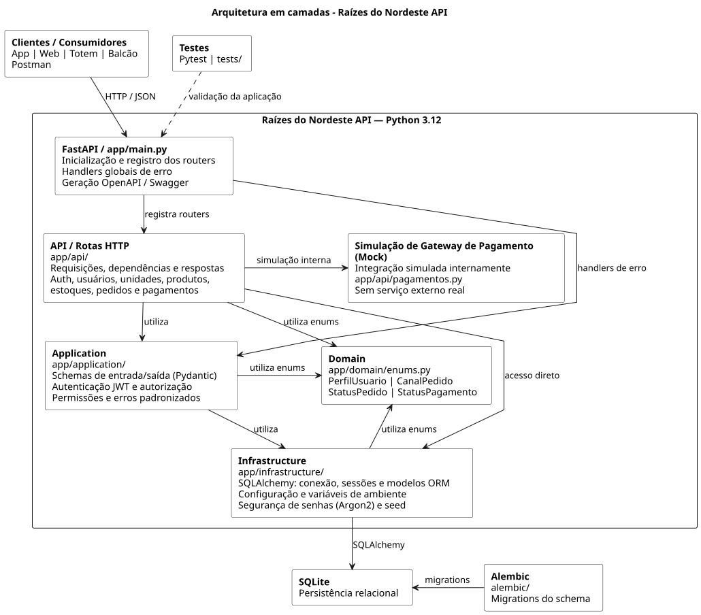

<div align="center">

# Raízes do Nordeste API

**API REST com autenticação, controle de acesso, estoque, pedidos, pagamentos e auditoria.**

[](https://github.com/jhoncts/RaizesDoNordesteAPI/actions/workflows/ci.yml)


</div>

## Visão geral

A **Raízes do Nordeste API** é uma API back-end desenvolvida em Python com FastAPI para simular a operação de uma rede de alimentação. O sistema reúne autenticação, autorização por perfil, unidades, produtos, estoque, pedidos, pagamentos, fidelidade e auditoria.

O projeto foi desenvolvido como parte do Projeto Multidisciplinar de Análise e Desenvolvimento de Sistemas e organizado como um portfólio técnico de back-end.

## O que este projeto demonstra

| Área | Implementação |
| --- | --- |
| API REST | FastAPI, rotas organizadas e documentação automática |
| Autenticação | JWT e hash de senha com Argon2 |
| Autorização | Controle de acesso por perfil |
| Persistência | SQLAlchemy, SQLite e migrations com Alembic |
| Regras de negócio | Estoque, pedidos, pagamentos, cancelamentos e fidelidade |
| Auditoria | Registro de operações relevantes |
| Qualidade | Testes automatizados com Pytest e CI no GitHub Actions |
| Documentação | Swagger, ReDoc, Postman e diagramas PlantUML |

## Funcionalidades

- cadastro e autenticação de usuários;
- autenticação por JWT;
- controle de acesso por perfil;
- gerenciamento de unidades e produtos;
- cardápio por unidade;
- controle de estoque;
- criação e consulta de pedidos;
- pedidos pelos canais `APP`, `WEB`, `TOTEM`, `BALCAO` e `PICKUP`;
- pagamento simulado;
- atualização e cancelamento de pedidos;
- devolução de itens ao estoque quando aplicável;
- programa de fidelidade mediante consentimento;
- auditoria de operações;
- tratamento padronizado de erros;
- documentação automática com Swagger e ReDoc.

## Fluxo principal do pedido

```text
Pedido criado
      │
      ▼
Aguardando pagamento
      │
      ├── pagamento recusado ──► PAGAMENTO_RECUSADO
      │
      ▼
Em preparo
      │
      ▼
Pronto
      │
      ▼
Entregue
```

## Arquitetura

O projeto utiliza uma separação em camadas para reduzir o acoplamento entre API, regras de aplicação e persistência.

<div align="center">
  
</div>

```text
RaizesDoNordesteAPI/
├── alembic/                 # migrations
├── app/
│   ├── api/                 # rotas HTTP
│   ├── application/         # schemas, autenticação e permissões
│   ├── domain/              # enums e regras de domínio
│   ├── infrastructure/      # banco, models, segurança e seed
│   └── main.py
├── docs/                    # diagramas e evidências
├── postman/                 # coleção de testes manuais
├── tests/                   # testes automatizados
├── .env.example
├── alembic.ini
└── requirements.txt
```

## Stack

- **Python 3.12**
- **FastAPI**
- **SQLAlchemy**
- **Alembic**
- **Pydantic**
- **PyJWT**
- **Argon2**
- **SQLite**
- **Uvicorn**
- **Pytest**
- **Postman**
- **PlantUML**
- **GitHub Actions**

## Executar localmente

Clone o projeto e crie o ambiente virtual:

```bash
git clone https://github.com/jhoncts/RaizesDoNordesteAPI.git
cd RaizesDoNordesteAPI
python -m venv .venv
```

No Windows:

```powershell
.\.venv\Scripts\Activate.ps1
pip install -r requirements.txt
```

Crie o arquivo `.env` a partir de `.env.example` e troque a chave JWT por uma chave própria.

Depois execute:

```powershell
alembic upgrade head
python -m app.infrastructure.seed
uvicorn app.main:app --reload
```

A API ficará disponível em:

```text
http://127.0.0.1:8000
```

Documentação interativa:

```text
Swagger: http://127.0.0.1:8000/docs
ReDoc:   http://127.0.0.1:8000/redoc
```

## Autenticação

Login:

```text
POST /auth/login
```

As rotas protegidas utilizam:

```text
Authorization: Bearer <token>
```

Perfis disponíveis:

| Perfil | Responsabilidade |
| --- | --- |
| `CLIENTE` | cria e consulta pedidos |
| `ATENDENTE` | operações relacionadas à entrega |
| `COZINHA` | atualização do preparo |
| `GERENTE` | operações administrativas |

## Testes e CI

Execute localmente:

```bash
pytest -v
```

O workflow de **CI** roda automaticamente a suíte de testes em cada push para `main` e em pull requests. O pipeline atual está configurado com Python 3.12 e ambiente isolado para o banco de testes.

A coleção Postman também está disponível em:

```text
postman/RaizesDoNordesteAPI.postman_collection.json
```

## Diagramas e evidências

O repositório inclui:

- diagrama de arquitetura;
- diagrama entidade-relacionamento;
- diagrama de classes;
- diagrama de casos de uso;
- arquivos `.puml` e `.svg`;
- evidências de Swagger, Pytest e fluxos da API.

Veja [docs/diagramas](docs/diagramas) e [docs/evidencias](docs/evidencias).

## Segurança e ambiente

- credenciais reais não devem ser versionadas;
- `.env` é ignorado pelo Git;
- `.env.example` contém apenas valores de exemplo;
- senhas de usuários são armazenadas com hash;
- a chave JWT deve ser substituída em cada ambiente.

## Contexto acadêmico

O estudo de caso **Raízes do Nordeste** é fictício. O projeto foi desenvolvido para fins acadêmicos e de portfólio, com foco em demonstrar práticas de desenvolvimento back-end, modelagem, segurança, testes e documentação.

---

<div align="center">

**Back-end desenvolvido com foco em regras de negócio, segurança e organização de código.**

</div>
